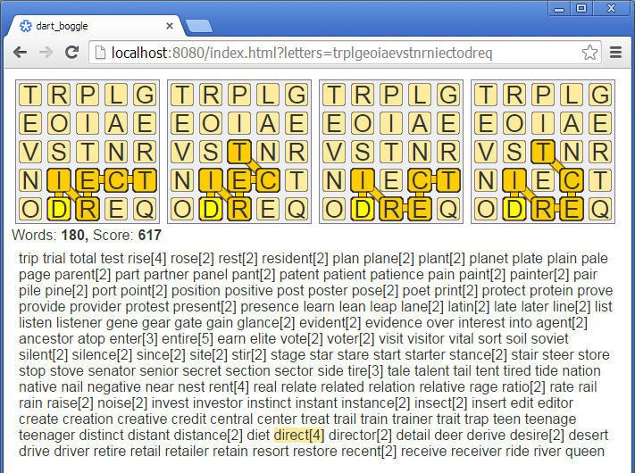

Boggle solver and visualizer in Dart/Polymer.

Also includes a command-line grinder which uses genetic algorithm for finding a boggle board layout with maximum score.

[Online demo](http://www.ruslans.com/boggle/index.html?letters=trplgeoiaevstnrniectodreq).

